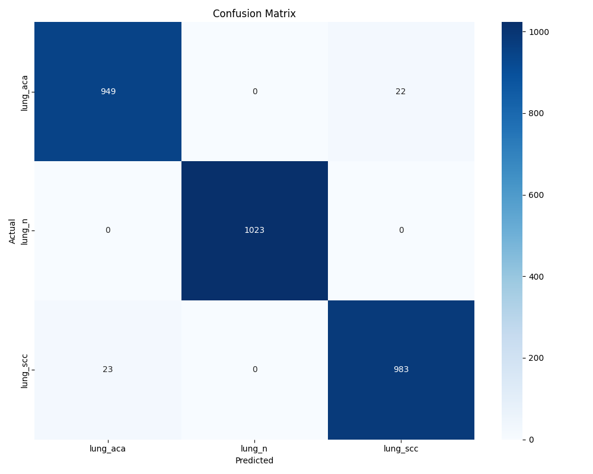

# Lung Cancer Detection with ResNet-18 🫁

## Overview

This repository contains a deep learning solution for automated lung cancer classification using the ResNet-18 architecture. The model achieves **98.50%** accuracy on the validation dataset, effectively distinguishing between lung adenocarcinoma (ACA), squamous cell carcinoma (SCC), and normal lung tissue.

## Features

- **High Accuracy:** Achieves 98.50% validation accuracy
- **Multi-class Classification:** Distinguishes between adenocarcinoma, squamous cell carcinoma, and normal tissue
- **Transfer Learning:** Leverages ResNet-18 architecture pre-trained on ImageNet
- **Reproducible Results:** Complete pipeline from data preparation to evaluation

- 
## Training Details
The model was trained using the following configuration:

- **Architecture:** ResNet-18 with modified final layer
- **Optimizer:** Adam with learning rate 0.001
- **Loss Function:** Cross-entropy loss
- **Batch Size:** 32
- **Data Augmentation:** Random horizontal flip, rotation, and normalization
- **Early Stopping:** Patience of 10 epochs

## Dataset

This project utilizes a dataset of CT scan images to train the model. The dataset consists of labeled images of **malignant** and **benign** tumors for lung cancer classification. It is used for detecting potential lung cancer cases from medical images.

## Model Performance

### Key Metrics
- **Accuracy:** 98.50%
- **Average Test Loss:** 0.0436
- **Micro F1 Score:** 0.9850
- **Macro F1 Score:** 0.9848
- **Weighted F1 Score:** 0.9850

### Classification Report

| Class | Precision | Recall | F1-Score | Support |
|-------|-----------|--------|----------|---------|
| lung_aca | 0.99 | 0.96 | 0.98 | 971 |
| lung_n | 1.00 | 1.00 | 1.00 | 1023 |
| lung_scc | 0.97 | 0.99 | 0.98 | 1006 |
| **Average** | **0.99** | **0.98** | **0.98** | **3000** |

### Confusion Matrix

## Requirements

- Python 3.7+
- PyTorch 1.9+
- torchvision
- scikit-learn
- pandas
- matplotlib
- numpy
- pillow

## Collaboration
Feel free to contact me if you have suggestions, improvements, or if you’d like to collaborate on further research or related projects.

Let’s work together to build a better future! 

## Contact:
For any queries, please reach me out to:
- **e-mail:** aadvikmazumdar@gmail.com
- **instagram:** aadvikmazumdar

## License
This project is licensed under the MIT License.
